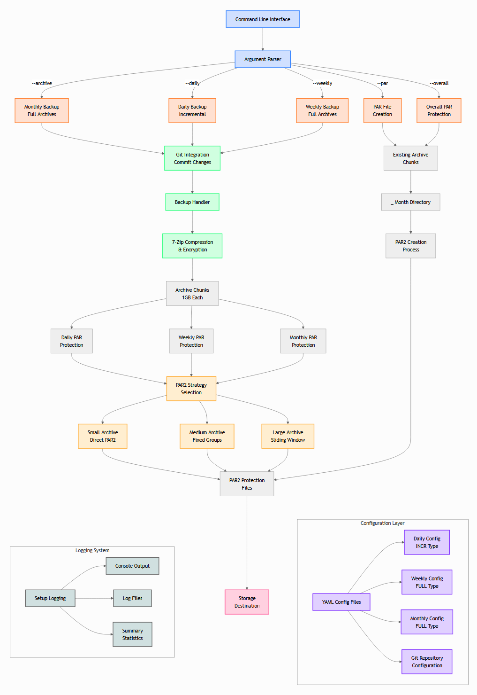

# AI-Learning by Building: Creating a Robust Multi-Tier Backup System

*By Rob van Eijk*

In this latest installment of my "AI-Learning by Building" series, I'll share how I created a comprehensive backup system for cloud storage providers that lack built-in management features.

The challenge was clear: **How to prevent vendor lock-in?** How do you protect your data when your cloud provider or on-premise backup solution doesn't offer [encryption](#glossary-of-terms), [lifecycle management](#glossary-of-terms), or regional replication? We'd need a robust backup set to store on any popular cloud drive solution. The approach works with all major providers, including:  
- [AWS S3](#glossary-of-terms) - Amazon's enterprise storage service
- [AWS Workdocs drive](https://aws.amazon.com/about-aws/whats-new/2019/09/workdocs_drive_custom_drive_letter/) - Amazon's document collaboration solution
- [DigitalOcean Spaces](https://www.digitalocean.com/products/spaces) - [AWS S3](#glossary-of-terms)-compatible object storage 
- [Microsoft OneDrive](https://www.microsoft.com/en-us/microsoft-365/onedrive/online-cloud-storage) - Microsoft's cloud storage service
- [Google Drive](https://workspace.google.com/products/drive/) - Google's file storage and synchronization service
- [iCloud Drive](https://www.icloud.com/iclouddrive/) - Apple's cloud storage solution
- [Nextcloud Files](https://nextcloud.com/files/) - Self-hosted file sharing and collaboration platform
- [ownCloud](https://owncloud.com/secure-file-sharing-and-storage/) - Open source file sharing and storage solution
- [Proton Drive](https://proton.me/drive) - Encrypted cloud storage from Proton
- [TransIP Stack](https://www.transip.nl/stack/) - Dutch cloud storage service
- And many others

This flexibility means you can choose the provider that best meets your needs for compliance, cost, or geographic location. The privacy-by-design approach should ensure your valuable information remains safe without locking you into a single provider, whether in the cloud or on-premise.

Note: This blog is written for readers without a technical background. At the end, you'll find plain-language explanations of all technical terms in the [Glossary of Terms](#glossary-of-terms).

## Summary

This blog post describes how I developed a vendor-independent backup approach that works with any cloud provider or on-premise solution. By combining [Git](#glossary-of-terms)-based change detection, [PAR2](#glossary-of-terms) redundancy protection, and adaptive [sliding window](#glossary-of-terms) techniques, I created a flexible system that ensures your data remains secure, recoverable, and free from vendor lock-in.

Throughout this post, you'll encounter technical terms like [PAR2](#glossary-of-terms) (Parity Archive Volume 2), a technology that creates special recovery files to repair damaged data, and [Git](#glossary-of-terms), a system that tracks file changes. Don't worry if these aren't familiar—each term is explained as it appears, and there's a comprehensive [glossary](#glossary-of-terms) at the end of the article.

The approach offers three-tier protection through daily [incremental backups](#glossary-of-terms), weekly [full backups](#glossary-of-terms), and monthly/yearly archives with optimized [compression](#glossary-of-terms), strong [encryption](#glossary-of-terms), and adjustable [redundancy](#glossary-of-terms) levels. It provides verifiable integrity, detailed change history, and complete control over data location for organizations with regulatory requirements.

Whether you're using [AWS S3](#glossary-of-terms), Microsoft OneDrive, Google Drive, or any other storage solution, this approach allows you to choose providers based on your specific needs while maintaining enterprise-grade protection for your valuable data.

## How This Fits in the "AI-Learning by Building" series
Each project in my "AI-Learning by Building" series has tackled different practical challenges:

**[Email Security System](https://github.com/rvaneijk/url-checker-sanitized/blob/main/doc/blog.md)**  
My first project focused on real-time protection for email, scanning links for threats before they reach your inbox.

**[Parametric EQ Fine-tuning](https://www.linkedin.com/pulse/ai-learning-building-parametric-eq-fine-tuning-music-rob-van-eijk-nn2te)**  
The second project explored audio optimization, using AI to find the perfect settings for listening to classical music.

**Robust Backup Approach**  
This project combines file management, data integrity, and cloud infrastructure to create a complete data protection solution. AI specifically helped with this project by finding a balance of technical measures, e.g., [redundancy](#glossary-of-terms), and overall protection.

While each project stands alone, they share a common theme: using AI assistance to implement sophisticated solutions that typically require specialized expertise. AI assistance significantly accelerated my development process. It helped with, e.g., (1) algorithm implementation, (2) debugging and error handling, (3) configuration parsing, and (4) testing approaches—similar to my previous projects on email security and audio equalization.

## What We Achieved

What started as a robust backup need evolved into a comprehensive backup approach for our organization's data (Figure 1 shows the complete system design). 

I developed a backup approach with three distinct tiers (plus primary storage), each serving a different purpose:

1. **Primary Storage**: The cloud drive where I actively work with my files

2. **Tier 1 - Daily Backups**: Captures only what changed in the last 24 hours, keeping these for 30 days

3. **Tier 2 - Weekly Backups**: Creates complete copies, stored for 4-12 weeks

4. **Tier 3 - Monthly/Yearly Archives**: Preserves comprehensive snapshots for long-term retention

This layered approach provides both convenience and security. Daily backups capture recent work without using much storage. Weekly backups offer more thorough protection. Monthly and yearly archives create a long-term historical record.

The approach handles everything automatically: identifying changed files, creating encrypted archives, and adding protection against file corruption. I've carefully configured the [7-Zip](#glossary-of-terms) [compression](#glossary-of-terms) and [encryption](#glossary-of-terms) settings for security and optimal performance, keeping legal and regulatory requirements in mind.

<p align="center">

</p>
<p><em>Figure 1. System Architecture: This diagram shows the backup approach's components.</em></p>

Let's break down how this backup approach works in non-technical terms:

1. **Command Interface**: Everything starts with simple commands that tell the system what type of backup to run (daily, weekly, or monthly) and what to protect.

2. **Smart Processing**: The approach first analyzes what needs backing up, then:
   - For daily backups, it efficiently identifies and saves only files that have changed
   - For weekly backups, it creates complete copies of important data
   - For monthly archives, it creates comprehensive snapshots for long-term preservation

3. **Security Layer**: All files are compressed and encrypted using strong security settings before storage (we use the [LZMA2 compression method](#glossary-of-terms)). This ensures your data remains private, even if someone gains unauthorized access to your backup files.

4. **Protection Mechanisms**: The approach creates special recovery files ([PAR2](#glossary-of-terms)) to repair your backups even if portions become damaged. Different strategies are applied based on the size of your backups:
   - Small backups use direct protection
   - Medium backups use organized group protection
   - Large backups use the sophisticated [sliding window](#glossary-of-terms) method

5. **Storage and Management**: Finally, backups are sent to your chosen storage destination with appropriate tags to manage retention periods. The entire process is logged, providing a complete record of all backup activities.

This multi-stage approach ensures your data remains protected, recoverable, and accessible regardless of your cloud provider.

## Compliance and Legal Considerations

For organizations with regulatory requirements, this backup approach offers several advantages:

**Complete Control of Data Location**  
Since the approach works with any storage provider, you maintain full control over where your data resides—essential for complying with [Data Sovereignty](#glossary-of-terms) laws. 

**Geographic Flexibility**  
The ability to store copies in different regions helps meet requirements for data to be held within specific jurisdictions.

**Verifiable Integrity**  
The protection provides cryptographic proof that your data remains intact and is valuable for compliance audits.

**Detailed Change History**  
[Git](#glossary-of-terms) integration maintains a complete record of document modifications, helping demonstrate proper document lifecycle management.

These features ensure your backup strategy can adapt to changing regulatory requirements without requiring a complete system redesign.

My backup approach is built on three key innovations that work together to ensure (A) data integrity, (B) efficiency, and (C) recoverability. Let me walk you through each and explain how they contribute to a comprehensive backup strategy.

## A: Finding Changed Files Efficiently

Have you ever wondered how to back up only what's changed without scanning every file on your drive? I solved this using [Git](#glossary-of-terms), a tracking system that maintains a detailed history of file changes.

Before each daily backup runs, our backup approach:

1. Checks each folder for what's new or different
2. Records these changes with a timestamp
3. Uses this information to back up only the necessary files

This approach is much faster than scanning everything. It also creates an audit trail showing exactly when documents were modified, something particularly valuable in legal contexts.

While efficiently identifying changed files minimizes the backup workload, we still need to ensure these backed-up files remain intact over time. This leads us to the second key innovation: built-in protection against file corruption.

## B: Redundancy - Protecting Against File Corruption

We all may have experienced the panic of a corrupted document. Hence, a robust backup approach should include built-in protection against this common problem. I use [PAR2](#glossary-of-terms) (Parity Archive Volume 2) technology—think of it as insurance for your digital files. 

How does it work? [PAR2](#glossary-of-terms) creates special "recovery files" alongside your backups. If your original files get damaged, these recovery files can repair them. Even if multiple sections are corrupted, your data remains recoverable.

For important documents that need long-term preservation, I apply stronger protection, see Table 1 below.

**Table 1. Redundancy Levels by Backup Type and Archive Size**

<div align="center">
<table>
  <tr>
    <th>Backup Type</th>
    <th>Archive Size</th>
    <th>Redundancy</th>
    <th>Overall Protection</th>
  </tr>
  <tr>
    <td rowspan="3"><strong>Daily Backups</strong><br>(30-day retention)</td>
    <td>Small</td>
    <td>10%</td>
    <td>10%</td>
  </tr>
  <tr>
    <td>Medium</td>
    <td>8%</td>
    <td>8%</td>
  </tr>
  <tr>
    <td>Large</td>
    <td>8%</td>
    <td>4%</td>
  </tr>
  <tr>
    <td rowspan="3"><strong>Weekly Backups</strong><br>(4-12 week retention)</td>
    <td>Small</td>
    <td>15%</td>
    <td>15%</td>
  </tr>
  <tr>
    <td>Medium</td>
    <td>12%</td>
    <td>8%</td>
  </tr>
  <tr>
    <td>Large</td>
    <td>12%</td>
    <td>6%</td>
  </tr>
  <tr>
    <td rowspan="6"><strong>Monthly/Yearly Backups</strong><br>(long-term retention)</td>
    <td>Very small</td>
    <td>30%</td>
    <td>30%</td>
  </tr>
  <tr>
    <td>Small</td>
    <td>25%</td>
    <td>25%</td>
  </tr>
  <tr>
    <td>Medium-small</td>
    <td>20%</td>
    <td>15%</td>
  </tr>
  <tr>
    <td>Medium</td>
    <td>18%</td>
    <td>12%</td>
  </tr>
  <tr>
    <td>Large</td>
    <td>15%</td>
    <td>10%</td>
  </tr>
  <tr>
    <td>Very large</td>
    <td>15%</td>
    <td>8%</td>
  </tr>
</table>
</div>

The "[Redundancy](#glossary-of-terms)" percentage represents how much recovery capability each backup has. Higher percentages mean stronger protection, which I apply to files that need longer preservation. The "Overall Protection" indicates the minimum percentage of recoverable data across the entire archive, even in worst-case corruption scenarios.

<p align="center">

</p>
<p><em>Figure 2. PAR2 Recovery Interface: This screenshot shows the verification of backup integrity. The recovery files created (199 recovery blocks) provide redundancy that allows the system to repair up to that many damaged blocks. The "Repair not needed" status indicates all 53 files are complete and undamaged, demonstrating successful protection.</em></p>

The [redundancy](#glossary-of-terms) levels described above work well for most backups, but large datasets present special challenges. This brings us to our third key innovation: an adaptive approach for managing backups of any size.

## C: Sliding Window - Smart Handling of Large Backups

Backing up large amounts of data presents unique challenges. The backup approach adapts its approach based on the size of what's being backed up:

For small backups, it creates simple protection files directly in the main folder.

For medium-sized backups, it organizes files into structured groups for better management.

For large backups, it uses an overlapping protection strategy I call "[sliding windows](#glossary-of-terms)."

To understand [sliding windows](#glossary-of-terms), imagine a row of 100 books, each a piece of your backup. Instead of protecting each book individually, this approach creates overlapping protective covers approach creates overlapping protective covers. Each cover protects 40 books at a time, with 20 books of overlap between covers.

This way, if several consecutive books are damaged, they can still be recovered using the protective covers from multiple windows. The approach ensures maximum recoverability with minimal storage overhead.

Here's a glimpse at the [sliding window](#glossary-of-terms) (Figure 3) and the protection code (Code Block 1). Note for non-technical readers: The following code example is included for technical transparency and is not essential for understanding the concept. Feel free to skip to the next section if you're primarily interested in the practical application.

<p align="center">

</p>
<p><em>Figure 3. Sliding Window Implementation: This screenshot demonstrates how large backups are divided into overlapping chunks (each folder represents a "window" of files). Each 3GB segment contains 25 files and overlaps with adjacent segments. This ensures that even if one segment becomes corrupted, the overlapping protection allows for complete recovery of the affected files.</em></p>

**Code Block 1. Sliding Window Implementation** 
```python
def create_par2_with_sliding_window(base_dir: str, archive_name: str, backup_type: str,
                                   incr: str, all_files: List[str], strategy: Dict, logger) -> None:
    """
    Create PAR2 recovery files using a sliding window approach for large archives.
    
    This function implements an overlapping protection strategy where each "window"
    covers a subset of archive files with deliberate overlap between adjacent windows.
    This approach ensures resilience against sequential corruption by providing
    multiple recovery paths for files that appear in more than one window.
    
    Parameters
    ----------
    base_dir : str
        Base directory where the archive files are located
    archive_name : str
        Name of the archive being protected
    backup_type : str
        Type of backup (e.g., "FULL", "INCR")
    incr : str
        Increment identifier, typically a date in YYMMDD format
    all_files : List[str]
        List of all archive chunk filenames to be protected
    strategy : Dict
        Dictionary containing parameters for the sliding window strategy:
        - window_size: Number of files in each window
        - window_slide: Number of files to slide between windows
        - par2_params: String of parameters to pass to the par2 command
    logger : Logger
        Logger object for recording operations and errors
    
    Returns
    -------
    None
    
    Notes
    -----
    The sliding window approach creates overlapping protective coverage where:
    1. Each window protects `window_size` files
    2. Adjacent windows overlap by `window_size - window_slide` files
    3. Each file is protected by at least one window, with files in overlapping
       regions protected by multiple windows
    
    This approach provides superior protection against sequential corruption
    compared to fixed-group approaches while maintaining reasonable storage overhead.
    """
    window_size = strategy['window_size']
    window_slide = strategy['window_slide']
    total_files = len(all_files)
    subdirs_created = []  # Track created subdirectories
    
    # Calculate number of windows
    num_windows = max(1, (total_files - window_size) // window_slide + 1)
    
    for window_index in range(num_windows):
        window_start = window_index * window_slide
        window_end = min(window_start + window_size, total_files)
        window_files = all_files[window_start:window_end]
        
        # Create a subdirectory for this window
        subdir = f"{incr}_{backup_type}_{archive_name}_{window_start:04d}-{window_end:04d}"
        subdir_path = os.path.join(base_dir, subdir)
        os.makedirs(subdir_path, exist_ok=True)
        subdirs_created.append(subdir_path)  # Track for cleanup
        
        # Create symlinks to avoid duplicating actual files
        for file in window_files:
            source_path = os.path.join(base_dir, file)
            link_path = os.path.join(subdir_path, file)
            if not os.path.exists(link_path):
                os.symlink(source_path, link_path)
        
        # Create PAR2 files in the subdirectory
        os.chdir(subdir_path)
        par2_base_name = f"{incr}_{backup_type}_{archive_name}_{window_start:04d}-{window_end:04d}"
        cmd = ["par2", "create"] + strategy['par2_params'].split() + [par2_base_name] + window_files
        
        try:
            subprocess.run(cmd, capture_output=True, text=True, check=True)
            logger.info(f"Created PAR2 files for window {window_start:04d}-{window_end:04d}")
        except Exception as e:
            logger.error(f"PAR2 creation failed for window {window_start:04d}-{window_end:04d}: {str(e)}")
        
        os.chdir(base_dir)
    
    # After all PAR2 files are created, clean up symlinks in each subdirectory
    for subdir_path in subdirs_created:
        cleanup_symlinks(subdir_path, logger)
```

These three ideas, i.e., (1) efficient change detection, (2) redundant protection, and (3) smart handling of large backups, form the foundation of my approach. I've also fine-tuned several additional settings to optimize performance and security to enhance the backup experience.

## Fine-Tuned Backup Settings

Security is a critical concern when backing up sensitive information. The backup approach uses [7-Zip](#glossary-of-terms) with carefully tuned settings that balance security, performance, and recoverability:

**Strong [Encryption](#glossary-of-terms)**  
I've enabled header [encryption](#glossary-of-terms) in all archives, which means the contents, the filenames, and structure are protected. This prevents unauthorized parties from seeing what documents exist in your backups.

**Optimized [Compression](#glossary-of-terms) Level**  
I use a balanced [compression](#glossary-of-terms) level (mx5) that shrinks files to about 30-40% of their original size without excessive processing time. This balanced approach works efficiently with text-heavy legal documents and PDFs, ensuring reasonable backup times while minimizing storage costs.

**[Parallelization](#glossary-of-terms) Power**  
The backup approach harnesses all available CPU cores when creating [PAR2](#glossary-of-terms) recovery files, dramatically reducing the time needed to process large archives. This parallel processing capability allows the approach to create robust protection for multi-gigabyte archives in minutes rather than hours, making comprehensive data protection practical even for tight backup windows.

**Split Archive Mode**  
Unlike default [7-Zip](#glossary-of-terms) settings, I've disabled "solid mode" for backups that must be split into multiple parts. This significantly improves recoverability if any portion becomes corrupted, as damage is contained to smaller sections.

**Large File Handling**  
For backups containing substantial files (like video depositions or database dumps), I've enabled special file filtering that optimizes how these files are processed, improving [compression](#glossary-of-terms) speed and integrity verification.

**Adaptive Memory Usage**  
The backup approach intelligently adjusts memory requirements based on the number of files you're backing up. It uses as little as 2GB for just a couple of files, gradually scaling up to 12GB for very large archives with over 70 files. This smart scaling ensures your backups process quickly without overwhelming your computer's resources.

These technical settings might seem minor, but they make a substantial difference in security and recoverability—especially important for organizations with strict data protection requirements.

## Lifecycle Rules and Geographic Replication 

While the approach works with any cloud provider, I created a specific implementation for [AWS S3](#glossary-of-terms) that showcases what's possible:

I tested with [AWS CloudFormation](#glossary-of-terms) to automatically set up and manage cloud storage buckets with intelligent management rules:

1. **Smart Cost Management**  
   The approach automatically moves older backups to cheaper storage tiers based on tags.

2. **Simple Policy Enforcement**  
   Weekly backups can be tagged as "monthly" or "yearly" to follow different retention policies.

3. **Geographic Redundancy**  
   Critical backups automatically copy to a different region for disaster recovery.

This setup includes:

**Multiple Storage Buckets**
- Primary bucket in your main region
- Secondary bucket in a different region for redundancy
- Automated copying between regions for critical data

**Intelligent [Lifecycle Rule](#glossary-of-terms)s Based on Tags**

Weekly backups (default):
- Move to lower-cost storage after 7 days
- Move to archive storage after 30 days
- Keep for 90 days total

Monthly-tagged backups:
- Move to lower-cost storage after 7 days
- Move to archive storage after 30 days
- Keep for 365 days (1 year)

Yearly-tagged backups:
- Move to lower-cost storage after 7 days
- Move to archive storage after 30 days
- Move to deep archive after 180 days
- Keep for 5 years

**Automated Tagging**

The process automatically identifies which weekly backups should be preserved longer. It marks the 4th backup of each month as "monthly" and the last backup of December as "yearly."

AI assistance was particularly helpful in setting up the cloud configuration, especially with the complex permissions needed for [cross-region replication](#glossary-of-terms).

## Conclusion

This backup approach allows you to use any cloud provider for long-term storage, regardless of their built-in features. By combining daily, weekly, and monthly backups—all protected against corruption—I've created a comprehensive solution that keeps data safe and recoverable.

The approach provides multiple layers of protection while managing costs through:
- Optimized computer resource usage
- Automated storage tier transitions
- Geographic redundancy
- Intelligent retention policies

This solution addresses the challenge of working with cloud providers lacking built-in management features, ensuring you're never locked into a single provider.

The project demonstrates how AI assistance can help create professional-grade systems tailored to personal needs. AI handled the complex algorithmic details, letting me focus on the overall design.

**Key Takeaways:**
- Vendor lock-in can be avoided through a provider-agnostic backup approach
- Three-tier backup strategy (daily, weekly, monthly/yearly) balances efficiency with thorough protection
- Smart [redundancy](#glossary-of-terms) through [PAR2](#glossary-of-terms) technology enables recovery even from corrupted backups
- [Sliding window](#glossary-of-terms) approach solves the challenge of efficiently protecting large datasets
- [Lifecycle Rule](#glossary-of-terms)s and geographic replication optimize storage costs while maintaining compliance
- AI assistance makes implementing enterprise-grade solutions accessible for smaller organizations

## Glossary of Terms

**7-Zip**: A file archiver with a high compression ratio, used to create compact backup files.

**AWS CloudFormation**: A service that lets you model, provision, and manage AWS resources by treating infrastructure as code.

**AWS S3**: Amazon Simple Storage Service, a cloud object storage service that offers scalability, availability, and security.

**Compression**: The process of reducing file size to save storage space.

**Cross-Region Replication**: The automatic copying of objects across AWS regions to ensure geographic redundancy.

**Data Sovereignty**: The concept that data is subject to the laws and governance of the country or region in which it is stored.

**Encryption**: The process of converting information into a code to prevent unauthorized access.

**Full Backup (FULL)**: A complete backup of all selected data, regardless of when it was last backed up.

**Git**: A system that tracks file changes, especially useful for code development and documentation.

**Incremental Backup (INCR)**: A backup that only includes files that have changed since the last backup, saving time and storage space.

**Lifecycle Rule**: A policy that automates the transition of objects between storage classes or their deletion after a specified time.

**LZMA2** (Lempel-Ziv-Markov chain Algorithm 2) is an advanced data compression algorithm used primarily in the 7z file format. It offers high compression ratios by using dictionary-based compression, context modeling, and adaptive encoding techniques.

**PAR2 (Parity Archive Volume 2)**: A method for creating special recovery files that can repair damaged data when parts of the original become corrupted. PAR2 works by generating mathematical parity data that reconstruct missing or corrupted pieces, even when multiple file sections are damaged. 

**Parallelization**: The process of dividing a task into smaller parts that can be executed simultaneously across multiple CPU cores.

**Redundancy**: Extra data added to backups to enable recovery if portions become damaged.

**Sliding Window**: A technique where overlapping groups of chunks are processed together to improve recovery capabilities.

---

*This article is part of the "AI-Learning by Building" series, which includes previous entries such as "[Creating an Enterprise-Grade Email Security System for Personal Use](https://github.com/rvaneijk/url-checker-sanitized/blob/main/doc/blog.md)" and "[Parametric EQ Fine-tuning for Listening to Classical Music.](https://www.linkedin.com/pulse/ai-learning-building-parametric-eq-fine-tuning-music-rob-van-eijk-nn2te)"*